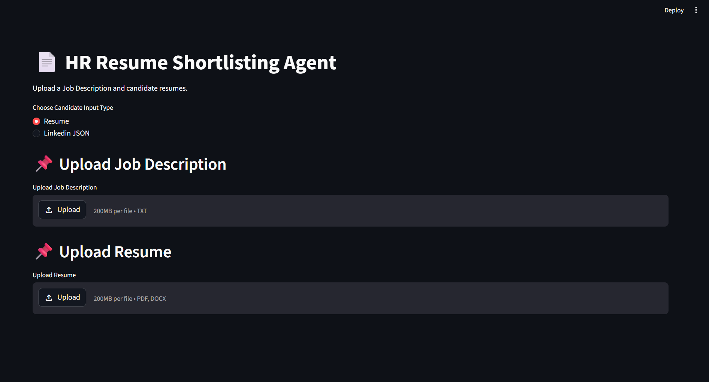
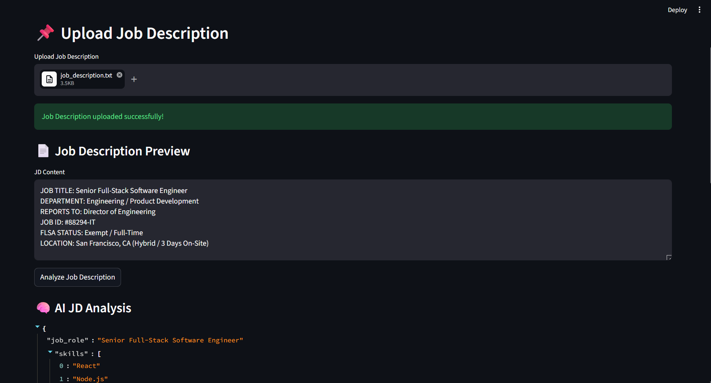
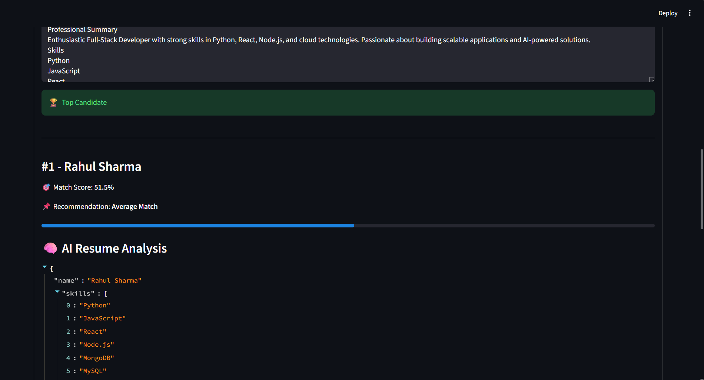
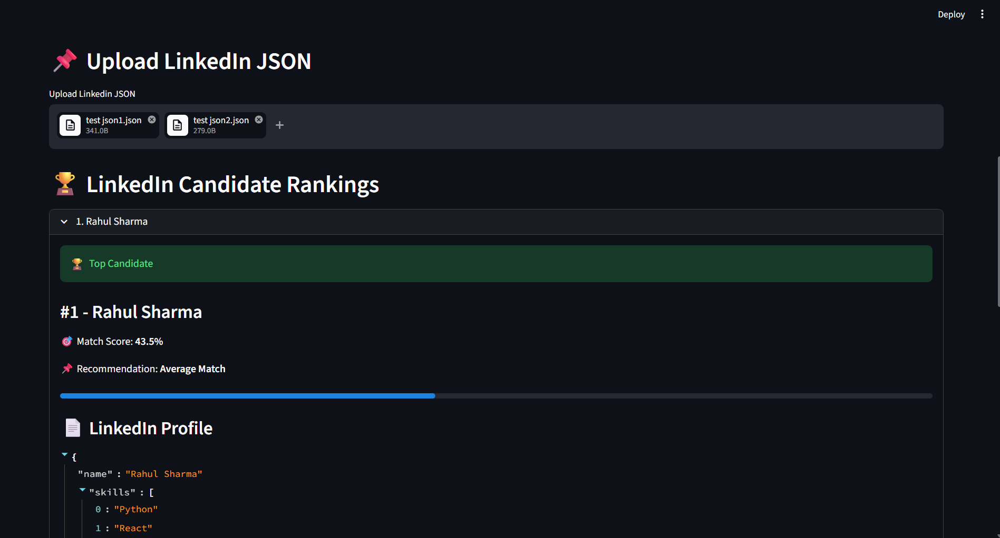
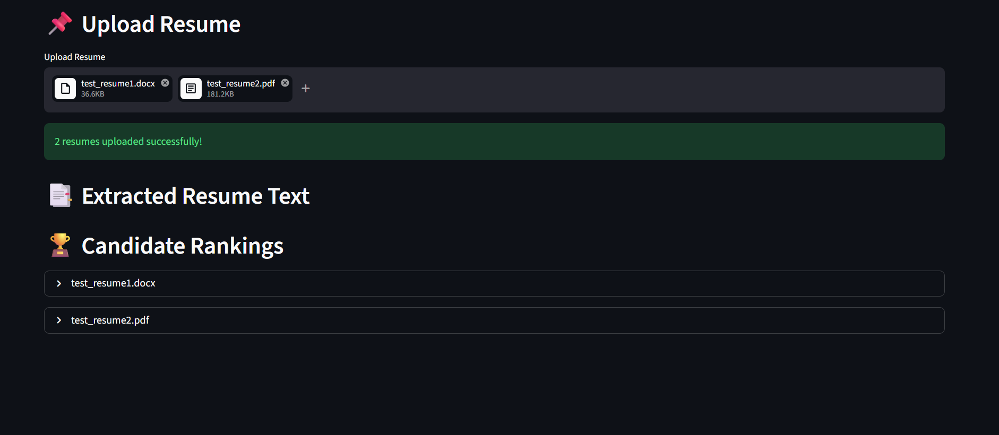

# 📄 AI-Powered HR Resume Shortlisting Agent

An AI-powered Resume Screening and Candidate Matching System built using **Python**, **Streamlit**, and **Groq LLM APIs**.

This project helps recruiters automate the candidate shortlisting process by analyzing Job Descriptions (JD), extracting candidate information from resumes or LinkedIn JSON profiles, and generating intelligent match scores with hiring recommendations.

---

# 🚀 Features

## ✅ Job Description Analysis

- Upload Job Description (TXT)
- AI extracts:
  - Required Skills
  - Experience
  - Education
  - Keywords
  - Technologies

---

## ✅ Resume Analysis

Supports:

- PDF Resumes
- DOCX Resumes

AI extracts:

- Candidate Name
- Skills
- Experience
- Education
- Projects
- Certifications
- Summary

---

## ✅ LinkedIn JSON Profile Support

Supports structured LinkedIn-style JSON profile uploads.

Example:

- Skills
- Experience
- Education
- Projects

---

## ✅ AI Matching Engine

The system compares:

- JD requirements
- Candidate profiles

And generates:

- Match Score
- Missing Skills
- Recommendation
- Candidate Ranking

---

## ✅ Candidate Ranking Dashboard

- Automatic ranking
- Top candidate highlighting
- Match visualization
- AI analysis display

---

# 🛠️ Tech Stack

| Technology    | Usage                 |
| ------------- | --------------------- |
| Python        | Core Backend          |
| Streamlit     | Frontend/UI           |
| Groq API      | AI Integration        |
| Llama 3.3 70B | Large Language Model  |
| PyPDF2        | PDF Parsing           |
| python-docx   | DOCX Parsing          |
| JSON          | Structured Data       |
| dotenv        | Environment Variables |

---

# 📂 Project Structure

```text
project/
│
├── ai/
│   ├── groq_client.py
│   ├── jd_analyzer.py
│   ├── resume_analyzer.py
│   ├── matcher.py
│   └── prompts.py
│
├── parsers/
│   ├── pdf_parser.py
│   ├── docx_parser.py
│   └── linkedin_parser.py
│
├── data/
│   ├── resumes/
│   └── jds/
│
├── app.py
├── requirements.txt
├── .env.example
├── .gitignore
└── README.md
```

---

# ⚙️ Installation & Setup

## 1️⃣ Clone Repository

```bash
git clone https://github.com/Parth119328/HR-Resume-Shortlisting-Agent.git
```

---

## 2️⃣ Move Into Project Folder

```bash
cd HR-Resume-Shortlisting-Agent-main
```

---

## 3️⃣ Create Virtual Environment

### Windows

```bash
python -m venv venv
```

Activate environment:

```bash
venv\Scripts\activate
```

---

## 4️⃣ Install Dependencies

```bash
pip install -r requirements.txt
```

---

# 🔑 Environment Variables Setup

Create a `.env` file in the root directory.

Example:

```env
GROQ_API_KEY=your_api_key_here
```

---

# ▶️ Run The Project

```bash
streamlit run app.py
```

---

# 📌 Application Workflow

```text
Upload Job Description
        ↓
AI extracts job requirements
        ↓
Upload Candidate Resumes
OR
Upload LinkedIn JSON Profiles
        ↓
AI extracts candidate information
        ↓
Matching Engine compares both
        ↓
Match Score + Recommendation
        ↓
Candidate Ranking Dashboard
```

---

# 🧠 AI Capabilities

The project uses LLMs for:

- Resume Parsing
- Job Description Understanding
- Skill Extraction
- Semantic Candidate Matching
- Hiring Recommendation Generation

---

# 📸 Screenshots

## 🏠 Home Page

Add Screenshot Here



---

## 📄 Job Description Analysis

Add Screenshot Here



---

## 📑 Resume Analysis

Add Screenshot Here



---

## 🔗 LinkedIn JSON Analysis

Add Screenshot Here



---

## 🏆 Candidate Ranking Dashboard

Add Screenshot Here




---

# 📄 Example LinkedIn JSON

```json
{
  "name": "Rahul Sharma",
  "skills": ["Python", "React", "AWS", "Docker", "JavaScript"],
  "experience": "2 years",
  "education": "Bachelor of Technology in Computer Science",
  "projects": ["AI Resume Screening System", "E-Commerce Website"]
}
```

---

# 📌 Example Features Demonstrated

- AI Resume Screening
- Recruiter Automation
- Candidate Ranking
- Resume Parsing
- LinkedIn Profile Analysis
- Intelligent Matching System
- Skill Gap Detection

---

# 🔒 Security Notes

- `.env` is excluded using `.gitignore`
- API keys are never hardcoded
- Environment variables are used securely

---

# 📚 Learning Outcomes

This project demonstrates understanding of:

- AI API Integration
- LLM Prompt Engineering
- Resume Parsing
- Streamlit UI Development
- Modular Python Architecture
- JSON Data Handling
- Candidate Matching Logic
- Recruiter Workflow Automation

---

# 🚀 Future Improvements

- PDF Job Description Support
- DOCX Job Description Support
- Semantic Embedding Search
- Vector Database Integration
- Authentication System
- Recruiter Login Dashboard
- Candidate Report Export
- Cloud Deployment
- Real LinkedIn API Integration
- Advanced Analytics Dashboard

---
